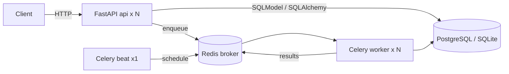
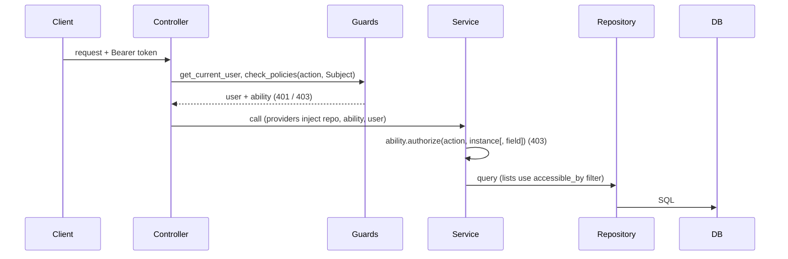

# 2. Architecture & Design

## Layout
| Path | Responsibility |
|---|---|
| `app/main.py` | App wiring: health router, `/api/v1` router, `ForbiddenError` -> 403 |
| `app/api/health.py` | Unversioned `/health`, `/ready` probes |
| `app/api/v1/router.py` | Assembles feature routers under `/api/v1` (bump to `v2/` for breaking API changes) |
| `app/api/v1/system.py` | Admin-only ops endpoints: `/databases`, `/tasks/*` |
| `app/core/config.py` | Typed settings from environment (fails fast on weak production secret) |
| `app/core/database.py` | Engine registry, per-request database/session providers |
| `app/core/migrations.py` | Runs Alembic against any engine (used at runtime and by `scripts/migrate.py`) |
| `app/core/security.py` | bcrypt hashing, JWT creation/validation |
| `app/core/casl.py` | CASL-style `Ability`, `AbilityBuilder`, `accessible_by` (rules -> SQL filter) |
| `app/features/auth/` | `abilities.py` (policies -> Ability), `dependencies.py` (guards), register/login/refresh |
| `app/features/roles/` | `Role` / `Policy` tables, `registry.py` (what policies may reference + validation), CRUD API, `seed.py` (default roles) |
| `app/features/users/`, `app/features/todos/` | `controller` -> `service` -> `repository`, plus models and schemas; todos also own the Celery `tasks.py` |
| `app/celery_app.py` | Celery app and beat schedule |
| `migrations/` | Alembic environment (multi-database) and revisions |
| `docker/`, `k8s/`, `scripts/` | Image and compose, cluster manifests (+ migrate Job), operational scripts |

Dependencies point inward: `api` -> `features` -> `core`. Features do not import each other's controllers; the few cross-feature imports are at the service/repository/model level (e.g. `auth` reads `users` and `roles`).

## Request flow

Controllers translate service exceptions to HTTP errors; services contain business and authorization rules; repositories only talk to the database.

## Authentication & authorization design
- Access tokens (15 min) and refresh tokens (7 days) are HS256 JWTs carrying `sub`, `type`, `db`, `exp`. The `db` claim binds a token to the database it was issued for, so a token cannot be replayed against another tenant database where the same user id means someone else.
- Rules are data: `role` and `policy` tables hold CASL rules as JSON. `define_abilities(user, policies)` loads the user's role policies on every request (one indexed query; no cache, so changes apply immediately across all pods), resolves `${user.*}` placeholders and builds the `Ability`. Later policies (higher id) override earlier ones; `cannot` with `fields` implements field-level protection (`role`, `is_active`).
- Stored rules are untrusted input until validated: `registry.validate_rule` checks subject/field/condition names against real columns, allow-lists operators, restricts placeholders and bounds sizes. The same check runs when loading, so a row edited directly in the database is skipped and logged instead of breaking requests.
- Guard rails: `admin` is immutable (always `manage all`, re-asserted on startup) so the system can't be locked out; system roles and roles in use can't be deleted; `Role`/`Policy` management is itself just a policy (delegable).
- Class-level checks (`check_policies`) ignore conditions ("could this user ever do this?"); instance checks evaluate them; list endpoints push the same rules into SQL so users never receive rows they may not read.
- Accessing another user's todo returns 403 (the id exists but is forbidden); unknown ids return 404.

## Key design points
- **Dynamic database**: URL from `DATABASE_URL` or parts; named connections from `DATABASES`; chosen per request by `X-Database` and forwarded to tasks. Users and todos are per database.
- **Timestamps**: stored as naive UTC.
- **Tasks are idempotent**: notify tolerates a missing row; purge is a bounded delete.
- **Scheduler**: single `beat` replica (Recreate strategy) to prevent duplicate runs.

## Security considerations
- Non-root container; secrets via env / Kubernetes Secret. In production the app refuses to start with a default or `change-me*` JWT secret.
- bcrypt password hashing (72-byte limit enforced by validation); constant-work login to resist user enumeration; generic 401 for all credential failures.
- `X-Database` only selects from an operator-defined allow-list.
- Known limitations: refresh tokens are not revocable, no rate limiting or lockout, registration reveals whether an email exists (409). Terminate TLS at the ingress.
- Dependency scanning via `pip-audit` in CI and Dependabot.

## Decisions
See `docs/adr/`.
