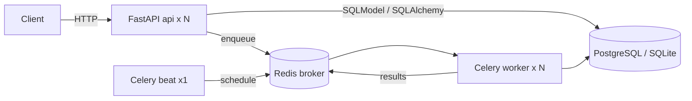

# 2. Architecture & Design

## Layout
| Path | Responsibility |
|---|---|
| `app/main.py` | HTTP layer: routing, validation, status codes |
| `app/crud.py` | Persistence operations (no HTTP knowledge) |
| `app/models.py` | SQLModel tables and request/response schemas |
| `app/database.py` | Engine registry; lazy, thread-safe, per-name engines; session dependency |
| `app/config.py` | Typed settings from environment |
| `app/celery_app.py`, `app/tasks.py` | Celery app, schedule, tasks |

## Key design points
- **Layering**: routes -> crud -> models. Routes never build SQL.
- **Schemas**: `TodoCreate` / `TodoUpdate` / `TodoRead` separate API contracts from the table model.
- **Dynamic database**: URL from `DATABASE_URL` or parts; named connections from `DATABASES`; chosen per request by `X-Database` and forwarded to tasks as the `db` argument so background work hits the same database.
- **Timestamps**: stored as naive UTC.
- **Tasks are idempotent**: notify tolerates a missing row; purge is a bounded delete.
- **Scheduler**: single `beat` replica (Recreate strategy) to prevent duplicate runs.

## Security considerations
- Non-root container user; secrets via env / Kubernetes Secret (placeholder in repo must be replaced).
- `X-Database` only selects from an operator-defined allow-list; clients cannot supply connection strings.
- No authentication yet: deploy behind an authenticating gateway until added (see Out of scope).
- Dependency scanning via `pip-audit` in CI and Dependabot.

## Decisions
See `docs/adr/`.
